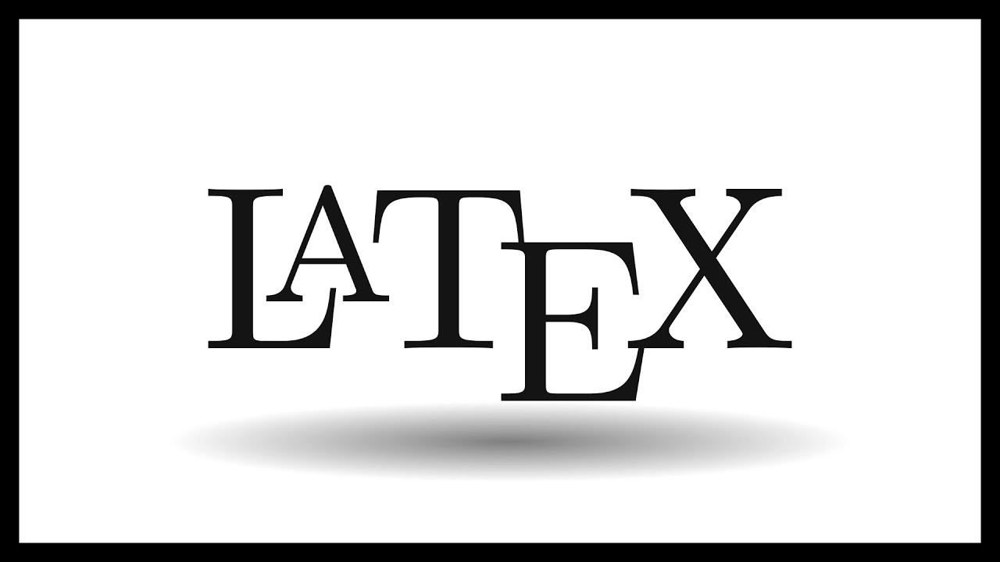

# Лабораторная работа №1


### Цель: 


Познакомиться с системой верстки текстов TeX, языком верстки TeX, издательской системой LaTeX.Выполнить вариант индивидуального задания.

### Основные используемые команды:
* `multicols`- для разбиения страницы на части;


* `itemize` - для создания списка;


* `textbf, textit` - форматирование текста


* $\coloneqq$` - специальные знаки (в данном случае ':=')


Другие сведения, и команды по работе с LaTeX можно посмотреть [здесь](https://www.overleaf.com/learn/latex/Learn_LaTeX_in_30_minutes)

Пример выполненого задания: 


# Лабораторная работа 3

### Цель: 

Познакомиться с программами git, освоить их программные аргументы.


### Про технологию:

 <b>Git</b> - это распределенное программное обеспечение для управления версиями. Контроль версий - это способ сохранять изменения с течением времени без перезаписи предыдущих версий. Распределение означает, что каждый разработчик, работающий с репозиторием Git, имеет копию всего этого репозитория - каждый фиксацию, каждую ветку, каждый файл.

 [Git](https://git-scm.com/)

 [GitHub](https://github.com/)
 
 ### Основные команды:
 
 1. Проверка стасуса

 ```
 git status
 ```
2. Добавление файлов

```
git add .
```
3. Создание коммита

```
git commit -m "message"
```
4. Загрузка на определенную ветку в GitHub

```
git push origin <название ветки>
```
### Ресурс для обучения командам Git [здесь](https://habr.com/ru/articles/541258/)

### Вывод: 
Мы познакомились с программами Git, освоили их программные аргументы.


# Расчетная работа

### Цель

### Задача
Необходимо разработать и реализовать программу на C/C++, которая решает
выданную преподавателем теоретико-графовую задачу а именно: "Найти n-фактор
для указанного графа в матрице инцидентности у ориентированного графа."