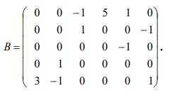

# Лабораторная работа №1


### Цель: 


Познакомиться с системой верстки текстов TeX, языком верстки TeX, издательской системой LaTeX.Выполнить вариант индивидуального задания.

### Основные используемые команды:
* `multicols`- для разбиения страницы на части;


* `itemize` - для создания списка;


* `textbf, textit` - форматирование текста


* $\coloneqq$` - специальные знаки (в данном случае ':=')


Другие сведения, и команды по работе с LaTeX можно посмотреть [здесь](https://www.overleaf.com/learn/latex/Learn_LaTeX_in_30_minutes)

Пример выполненого задания: 


# Лабораторная работа 3

### Цель: 

Познакомиться с программами git, освоить их программные аргументы.


### Про технологию:

 <b>Git</b> - это распределенное программное обеспечение для управления версиями. Контроль версий - это способ сохранять изменения с течением времени без перезаписи предыдущих версий. Распределение означает, что каждый разработчик, работающий с репозиторием Git, имеет копию всего этого репозитория - каждый фиксацию, каждую ветку, каждый файл.

 [Git](https://git-scm.com/)

 [GitHub](https://github.com/)
 
 ### Основные команды:
 
 1. Проверка стасуса

 ```
 git status
 ```
2. Добавление файлов

```
git add .
```
3. Создание коммита

```
git commit -m "message"
```
4. Загрузка на определенную ветку в GitHub

```
git push origin <название ветки>
```
### Ресурс для обучения командам Git [здесь](https://habr.com/ru/articles/541258/)

### Вывод: 
Мы познакомились с программами Git, освоили их программные аргументы.


# Расчетная работа

## Тема

<strong> Разработка программы решения теоретико-графовой задачи. </strong>

### Цель

Ознакомиться с основами теории графов, способами представления графов, базовыми алгоритмами для работы с разными видами графов.

### Задача
Необходимо определить n-фактор для указанного графа.
Нужно найти колличество входящих рёбер в вершину и выходящих. Граф задается матрицей интидентности, данные которой вводит пользователь. Вывод работы программы выводится в консоль.

.png)

#### Это пример ориентированного графа.



#### Это пример матрици инцидентности.
### Вариант
5.31 ми, ог (Найти n-фактор для указанного графа)
ми - матрица инцидентности.
ог - ориентированный граф.

## Ключевые понятия

- **Графовая структура** (абсолютное понятие) - это такая одноуровневая реляционная струк-
тура, объекты которой могут играть роль либо вершины, либо связки:

   - Вершина (относительное понятие, ролевое отношение);

   - Связка (относительное понятие, ролевое отношение).

- **Граф** - совокупность двух множеств множества самих объектов, называемого множеством вершин, и множества их парных связей, называемого множества рёбер.

- **Ориентированный граф** - граф, в котором ребра не имеют направления, то есть связь между вершинами двусторонняя.

- **Неоринтированный граф** - граф, в котором ребра не имеют направления, то есть связь между вершинами двустронняя.

- **Матрица смежности** - квадратная матрица размера *n*&times;*n*, где *n* - количество вершин в графе. Каждый элемент матрицы [i][j] указывает наличие (1) или осутствие (0) ребра между вершинами *i* *j*.

- **Матрица инцидентности** - матрица размера *n*&times;*m*, где *n* - количество вершин, а *m* - количество ребер в графе. Каждый элеимент [i][j] указывает, инцидента ли вершина *i* ребру *j*.

- **Список смежности** (список инцидентности) - представление графа в виде массива списков, где каждый список содержит вершины, смежные с данной вершиной.

- **Степень вершины графа** - количество рёбер, для которых она является концевой(при этом петли считают дважды).

- **Планарный граф** - это граф, который можно нарисовать на плоскости без пересечения ребер. Другими словами, граф является плоским, если его можно вложить в плоскость так, чтобы никакие ребра не пересекались.
- **Взвешенный неориентированный граф** - граф, в котором каждому ребру приписан вес (например, длинна или стоимость) и  ребра не имеют направления (связи двусторонние).
- **Взвешенный ориентиованный граф** - граф, в котором каждому ребру приписан вес и ребра имеют направление (связи односторонние).
- **n-фактор графа** - это подмножество рёбер графа, которое образует подграф, где каждая вершина имеет степень, равную n. Проще говоря, n-фактор — это такой набор рёбер, который соединяет все вершины графа так, что у каждой вершины ровно n рёбер (или, в терминах теории графов, каждая вершина имеет степень n).
- **Реберная связь (или ребро)** - это связь между двумя вершинами. В неориентированном графе ребро обозначает двустороннюю связь, а в ориентированном графе ребро имеет направление, указывающее одностороннюю связь от одной вершины к другой.
- **Мост графа (или изолирующее ребро)** - это ребро в графе, удаление которого приводит к увеличению числа компонента связаности графа. Иными словами, мост соединяет две части графа, и его удаление разделяет граф на две и более несвязанные части.

## Алгоритм решения

1. ркрагкпргкп
   1.1 ркгпргк